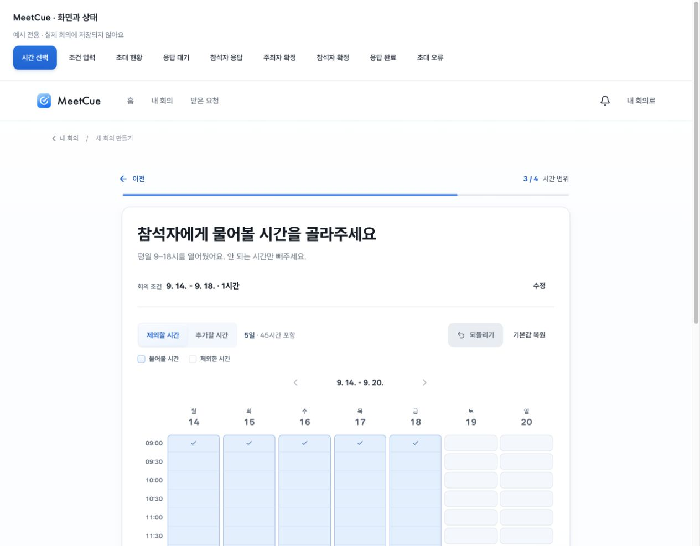
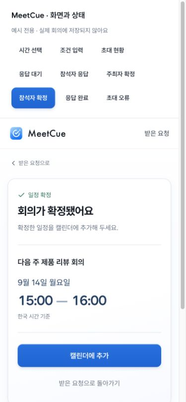
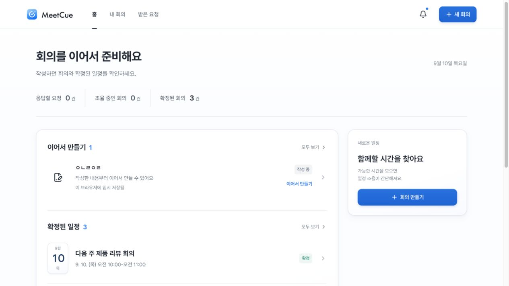

# 화면 개선 적용 기록

2026-09-10. [검토 계획](plan.md)의 순서대로 주요 화면과 공통 컴포넌트를 확장했다.

## 적용한 변화

| 순서              | 결과                                                                                                     | 확인한 동작                                                                                           |
| ----------------- | -------------------------------------------------------------------------------------------------------- | ----------------------------------------------------------------------------------------------------- |
| 1. 만들기         | 질문·조건 요약을 압축하고 선택량·복원을 시간표 위에 배치. 연속 시간 범위, 공통 선택 재질과 오류 표현     | 방향키 이동·Enter 선택, 마지막 변경 복원, 회의 길이 라디오 방향키, 15분 직접 입력 오류와 진행 불가    |
| 2. 초대·응답·확정 | 사람 행 공통화, 응답 요약을 앞에 배치, 모바일 초대 도구 펼침. 양쪽 확정은 같은 완료 틀·큰 날짜/시간 사용 | 모바일 초대 메뉴, 후보별 응답과 조정 확인 대화상자, Escape 닫기. 확정·응답 완료·초대 오류 예시 렌더링 |
| 3. 홈·목록        | 빈 조율 영역을 줄이고 실제 작성 중·확정 항목을 본문에 배치. 목록·필터·검색·날짜 컴포넌트 공유            | 검색 결과/빈 결과, 완료 요청 필터 이동, 로고 홈 이동                                                  |
| 4. 시스템         | 재질 토큰과 화면 레이아웃 책임 분리, 이관한 구형 CSS 정리, 9개 상태 검토 페이지                          | 시간표 390/768/1280px, 모바일 초대/확정의 가로 넘침과 행동 영역 확인                                  |

무드보드 005·011의 흰 면, 얕은 그림자, 옅은 파란 선택을 공통 토큰으로 연결했다. 배경은 거의 흰색이며 주 카드와 보조 카드의 깊이를 통일했다. 큰 시간표 안의 칸은 개별 부유 카드 대신 이어진 범위로 표현한다.

## 개발 중 비교

[검토 페이지](http://127.0.0.1:5173/meetcue/design-review.html)는 실제 제품 컴포넌트를 예시 데이터로 보여준다. 실제 회의와 저장소를 공유하지 않으며 전체 사용자 여정을 대체하지 않는다.

## 검증과 남은 범위

- 빌드·린트·공백 검사 통과. 기존 도메인 테스트 44개 통과.
- 실제 서비스에서는 조회·검색·필터·화면 이동을 확인했고, 상태를 바꾸는 조작은 독립 예시에서만 수행했다.
- 390px의 초대 메뉴 링크가 구형 전역 CSS 때문에 좁아지는 문제를 발견해 제거했다. 모바일 하단 버튼 폭과 데스크톱 알림 버튼 줄바꿈도 수정했다.
- 시간표는 키보드 단일 칸 선택, 모바일 폭에서 탭 선택을 확인했다. 드래그 미리보기 우선순위·Escape 취소 처리는 코드에서 보강했으나 실기기 드래그/터치 스크롤 검증은 남아 있다.
- 만들기 1·2·4단계 내부의 추가 구조 개편, 참석 기준 편집과 전체 참석자 시간표의 완전한 이관, 스크린리더·전체 색 대비 측정은 이번 완료 범위에 포함하지 않는다.

공통 컴포넌트와 스타일의 책임은 [디자인 시스템](../system.md)을 따른다. 이 문서는 제품 판단을 강제하는 규칙이 아니라 현재 구현과 다음 검토의 출발점이다.
