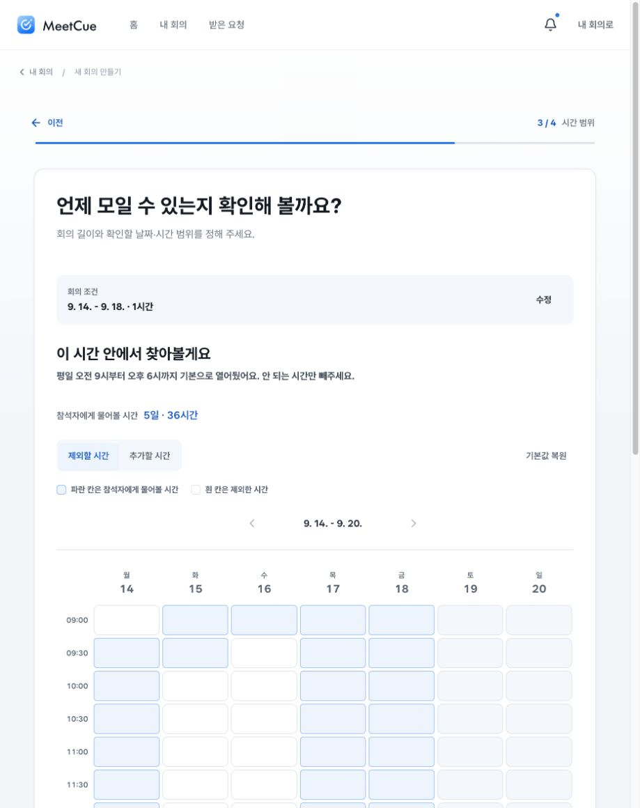
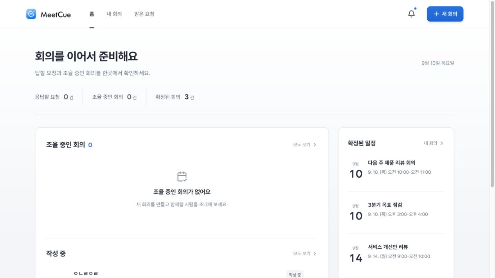
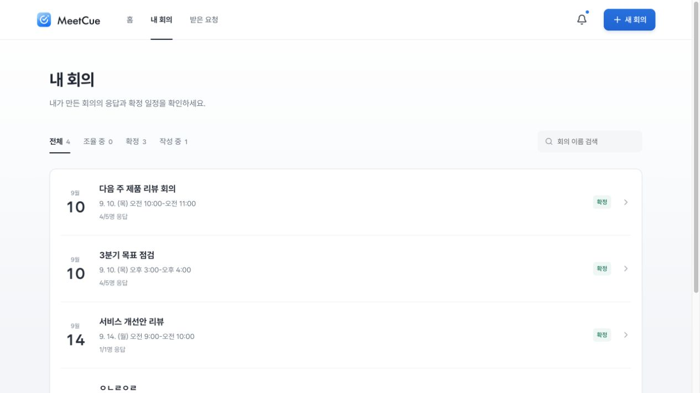
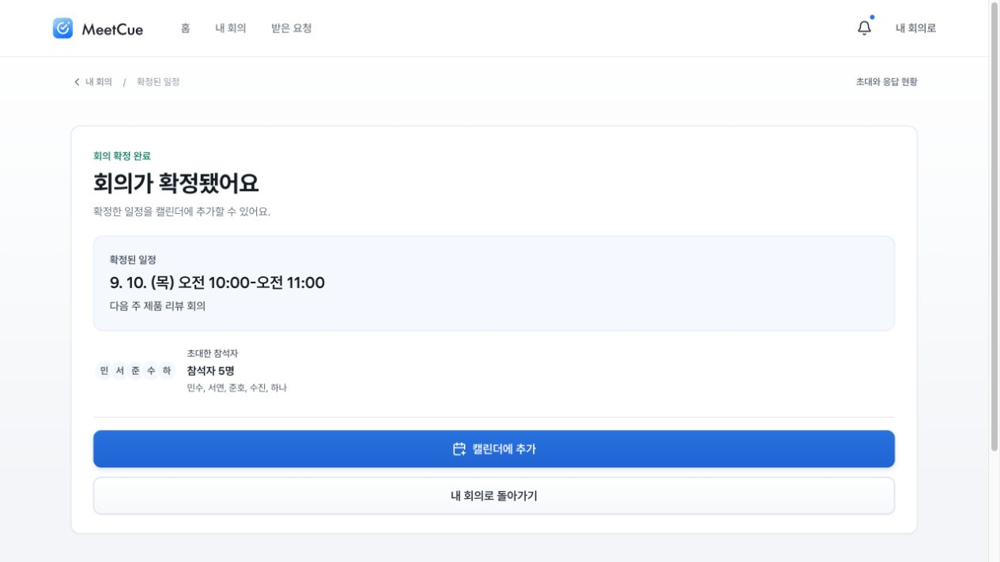
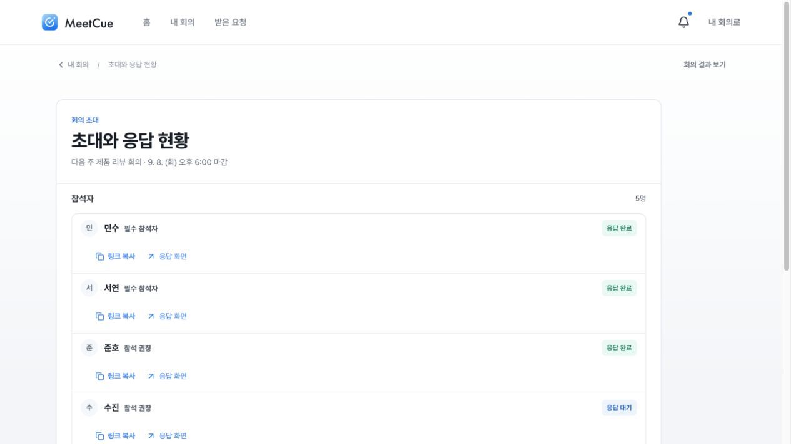
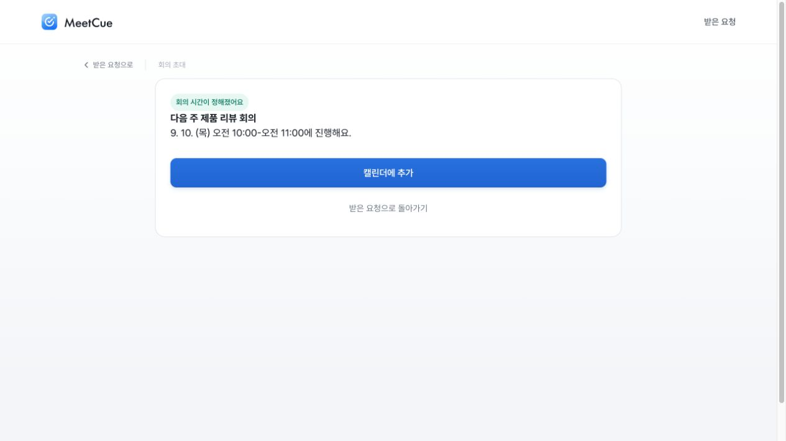
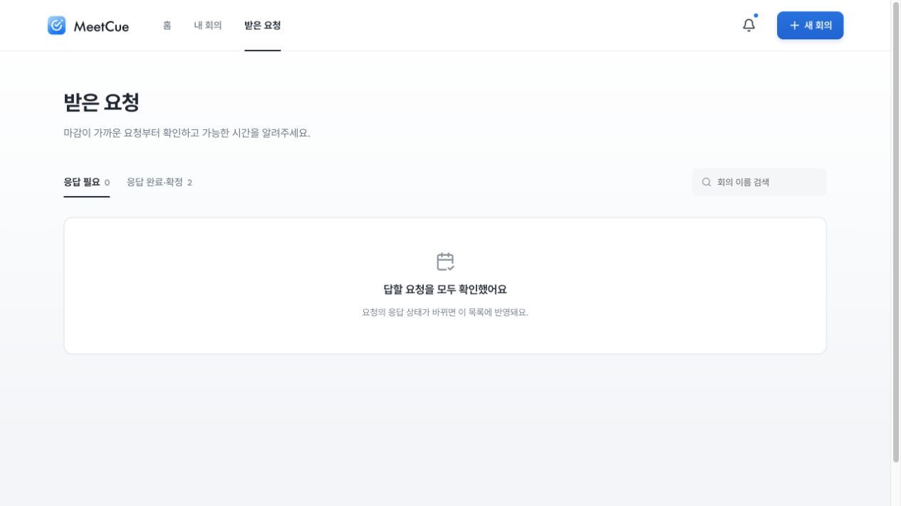

# 화면 검토와 디자인 시스템 확장 계획

2026-09-10. 이번 브라우저에서 확인한 7개 화면을 근거로 작성했다. 구현 변경 전 우선순위를 정하는 계획이다.

후속 적용: 사용자의 진행 요청에 따라 주요 화면 개선과 공통화를 수행했다. 결과와 남은 검증은 [구현 기록](implementation.md)에 정리했다. 아래 내용은 변경 전 진단으로 보존한다.

## 판단

먼저 회의 만들기의 입력·시간 선택을 정리하고, 초대·참석자 흐름과 확정 화면을 연결한 뒤, 홈·목록으로 확장한다. 재질만 일괄 교체하면 큰 빈 영역, 긴 안내, 반복된 카드 중첩은 남는다. 각 화면의 정보 순서를 먼저 정하고 공통 컴포넌트를 함께 이관한다.

무드보드 011의 밝은 선택 면·짧은 그림자, 005의 응답 카드, 010의 정돈된 시간 비교를 참고한다. 거의 흰 배경을 유지하고 얕은 깊이는 컨테이너·선택 도구에 집중한다. 모든 시간 칸이나 목록 행을 떠 있는 카드로 만들지 않는다. 주요 면과 보조 면의 재질은 같게 두되 글자·간격·배치로 중요도를 구별한다.

## 이번에 본 화면

### 1. 회의 만들기 / 시간 범위 — 구조 개선 우선

좋은 점: 단계, 현재 날짜 범위, 편집 모드와 선택 범례가 있다. DOM에서 시간 칸에 날짜·시각·선택 상태가 제공된다.

문제: 페이지 제목 → 설명 → 회의 조건 → 두 번째 제목 → 설명 → 시간 합계 → 편집 도구 → 범례 → 주간 이동을 지나야 시간표가 시작한다. 현재 화면에서는 시간표가 하단에 걸려 실제 작업보다 안내에 공간이 더 쓰인다. 옅은 파란 칸·흰 칸·비활성 주말은 육안 구분이 약하다.

계획: 상단을 질문 한 줄과 날짜·길이 요약으로 줄이고, 모드·선택량·복원을 시간표 바로 위 도구 모음에 묶는다. 시간표는 하나의 작업 면으로 다룬다. 선택은 색 외에도 경계·범위 표시로 보강한다. 키보드 범위 선택, 드래그 취소/복구, 모바일 스크롤과 선택 충돌은 별도 검증한다.

### 2. 홈 — 상태에 따른 공간 배분 필요

좋은 점: 요약에서 요청·회의 목록으로 이동할 수 있고, 작성 중인 회의를 이어갈 수 있다.

문제: 조율 중인 회의가 0개인데 큰 빈 상태가 중앙을 차지한다. 작성 중 항목은 아래로 밀리고, 실제 확정 일정 3개는 좁은 보조 열에 있다. 비어 있는 영역이 가장 중요한 것처럼 보인다.

계획: 응답 필요·작성 중·다가오는 일정 중 실제 할 일이 있는 묶음을 앞에 둔다. 빈 상태는 짧은 한 묶음으로 줄인다. 홈에서는 각 상태를 대표하는 소수 항목을 보여주고 목록 화면과 역할을 나눈다. 독립 카드 수를 늘리지 않고 여백과 섹션으로 구분한다.

### 3. 내 회의 — 기존 구조를 살려 공통화

좋은 점: 상태 필터와 검색, 날짜→제목→일정의 반복 구조가 명확하다.

문제: 확정된 항목에서도 응답률을 같은 층위로 반복한다. 날짜 타일이 결과 화면의 공통 날짜와 별개이며, 상태 배지·검색·선택 필터는 서로 다른 표현을 쓴다.

계획: 기존 MeetingRow를 분리해 홈·내 회의·받은 요청에서 함께 사용한다. 확정은 일정, 조율 중은 응답 진행, 작성 중은 이어쓰기 정보를 우선한다. 고정 행 높이보다 공통 패딩과 텍스트 행수를 기준으로 밀도를 정한다.

### 4. 주최자 확정 — 날짜·시간 위계 정리

좋은 점: 완료 여부와 캘린더 추가 행동이 명확하다.

문제: 전체 폭의 큰 카드 안에 또 큰 일정 카드가 들어가고, 실제 일정은 한 줄로만 보인다. 결과 화면에서 강조하던 날짜·시간 표현이 여기서 끊긴다. 참석자 영역은 초대 인원이며 실제 참석 가능 인원과 혼동하지 않도록 계속 명확히 표시해야 한다.

계획: 공통 일정 요약에 날짜·시간·회의명을 재배치한다. 제목과 시간 크기를 역할에 맞게 정하고, 성공 안내·일정·다음 행동을 하나의 자연스러운 흐름으로 묶는다.

### 5. 초대와 응답 현황 — 요약과 반복 행동 정리

좋은 점: 참석 역할, 응답 상태, 개인별 링크의 대상이 명확하다.

문제: 각 사람의 링크 복사·응답 화면이 별도 줄을 차지해 목록이 길다. ‘4명이 이미 응답’이라는 전체 요약이 목록 뒤에 있다. 현재 확정된 회의에서도 초대 관리 중심의 제목과 오래된 마감 정보가 가장 먼저 보인다.

계획: 응답 완료/대기 요약을 목록 앞에 배치한다. 데스크톱은 이름·역할·상태·보조 행동을 같은 행에 정렬하고 모바일에서는 필요한 보조 행동만 펼친다. 확정 여부에 맞춰 상단 설명을 바꾼다. 데모 전용 응답 화면 이동은 실제 사용자 행동과 시각적 우선순위를 구별한다.

### 6. 참석자 확정 — 주최자와 표현 차이가 큼

좋은 점: 불필요한 관리 도구 없이 일정과 캘린더 추가에 집중한다.

문제: 주최자 확정과 같은 사실을 보여주지만 제목·시간은 작고, 넓은 파란 버튼이 가장 강하다. 카드 폭, 성공 표시, 본문 여백도 별개다.

계획: 주최자 확정과 동일한 일정 요약·완료 화면 틀을 재사용한다. 역할에 따른 정보와 보조 행동만 바꾼다. 핵심 날짜·시간을 버튼보다 먼저 읽게 만든다.

### 7. 받은 요청 / 빈 상태 — 구조는 안정적, 안내는 상태 반영 필요

좋은 점: 내 회의와 필터·검색 구조가 비슷하고, ‘요청 없음’과 ‘응답 완료·확정’을 구별한다.

문제: 응답할 요청이 0개인데 상단은 계속 가능한 시간을 알려달라고 안내한다. 빈 상태가 넓은 카드로 남고 완료 항목은 다른 필터에 있다.

계획: 빈 상태와 제목 설명을 현재 상태에 맞춘다. 기존 필터·검색과 EmptyState를 공통화하고 완료 일정으로 갈 수 있는 짧은 안내를 제공한다.

## 구현 순서와 컴포넌트 범위

| 순서 | 작업 묶음                   | 코드 출발점                                                                                         | 완료 기준                                                                             |
| ---- | --------------------------- | --------------------------------------------------------------------------------------------------- | ------------------------------------------------------------------------------------- |
| 1    | 만들기: 입력·단계·시간 선택 | CreateFlowFrame, MeetingTimeConstraintsStep, BlockTimeRangePicker, 기존 Button/Input/SelectableCard | 안내를 줄인 시간표 배치, 입력/선택/오류/비활성 구분, 기존 초안 보존, 키보드·터치 확인 |
| 2    | 초대·응답·확정 흐름         | HostShell, ParticipantPageShell, ParticipantMeetingContext, ParticipantConfirmedScreen              | 응답 요약 우선 배치, 사람 행 공통화, 역할별 확정 화면의 일정 표시 통일                |
| 3    | 홈·내 회의·받은 요청        | AccountScreens 내부 PageHeader/EmptyState/DateTile/MeetingRow/ListToolbar                           | 기존 지역 컴포넌트를 재사용 가능한 단위로 분리, 빈 상태 축소, 상태별 핵심 정보 우선   |
| 4    | 전체 회귀 검토와 기준 확정  | docs/design/system.md 및 공통 스타일                                                                | 일반·선택·호버·포커스·비활성·오류 표본, 390/768/1280px 검증, 구형 재질 덮어쓰기 제거  |

공통 작업은 1번과 함께 시작한다. 먼저 대규모 라이브러리를 따로 만들지 않는다. 기존 MainCard와 CalendarDate/TimeRange를 확장 사용하고, 기존 Button/Input/SelectableCard의 상태 표현을 같은 토큰에 맞춘다. MainCard는 컨테이너, SelectableCard는 실제 선택 컨트롤이라는 책임을 유지한다.

색·재질을 담은 토큰은 의미별로 관리하되, `soft-material.css`를 모든 컴포넌트의 스타일을 쌓는 파일로 키우지 않는다. 기본 토큰, 컨트롤, 도메인 컴포넌트, 화면 배치를 나누고 실제 이관한 구형 CSS만 제거한다. 새 역할이 확인될 때만 컴포넌트를 추가한다.

첫 작업의 범위는 **만들기 3단계의 조건 입력과 시간표**로 제한한다. 여기서 선택 컨트롤·폼·도구 모음의 기준을 잡으면 참석자 응답에도 재사용할 수 있다. 애니메이션은 선택 범위 변화, 펼침, 완료 피드백처럼 행동 결과를 설명할 때만 넣고 움직임 줄이기를 지원한다.

## 확인 범위와 남은 검증

- 이번에 실제 열린 화면의 스크린샷과 DOM을 근거로 했다. 화면 1은 사용자의 기존 뷰포트, 나머지는 별도 검토 탭의 데스크톱 뷰포트라 절대 픽셀 크기 비교는 하지 않았다.
- 현재 저장된 회의는 확정 상태이고 응답 필요 목록은 비어 있다. 참석자 응답 편집, 주최자 응답 대기, 요청 발송 완료, 초대 오류, 만들기 1·2·4단계는 이번 시각 검토에서 확인하지 않았다. 이 화면들은 해당 작업 묶음 시작 시 독립 테스트 데이터로 먼저 캡처한다.
- 실제 색 대비 수치, 스크린리더, 모바일 반응형, 전체 키보드 이동, 드래그와 터치는 이번 계획 단계에서 검증하지 않았다. 시간 칸의 낮은 대비와 작은 보조 글자는 접근성 위험이며 실패 판정은 추가 측정 후 한다.
- 사용자의 초안·시간 선택을 변경하지 않았고, 새 회의 생성·확정·응답 제출·메시지 발송을 하지 않았다. 앱 구현은 변경하지 않았다.
