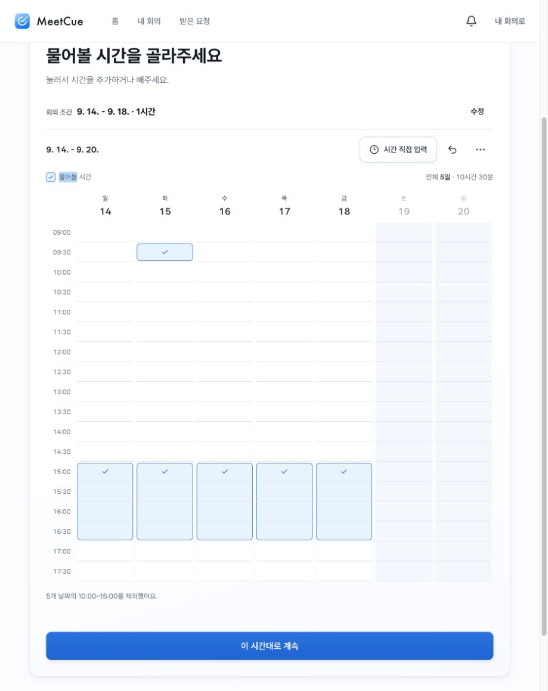
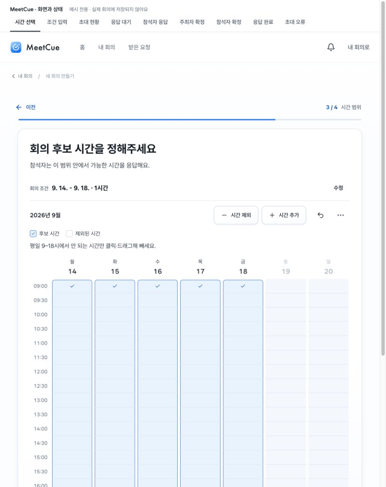
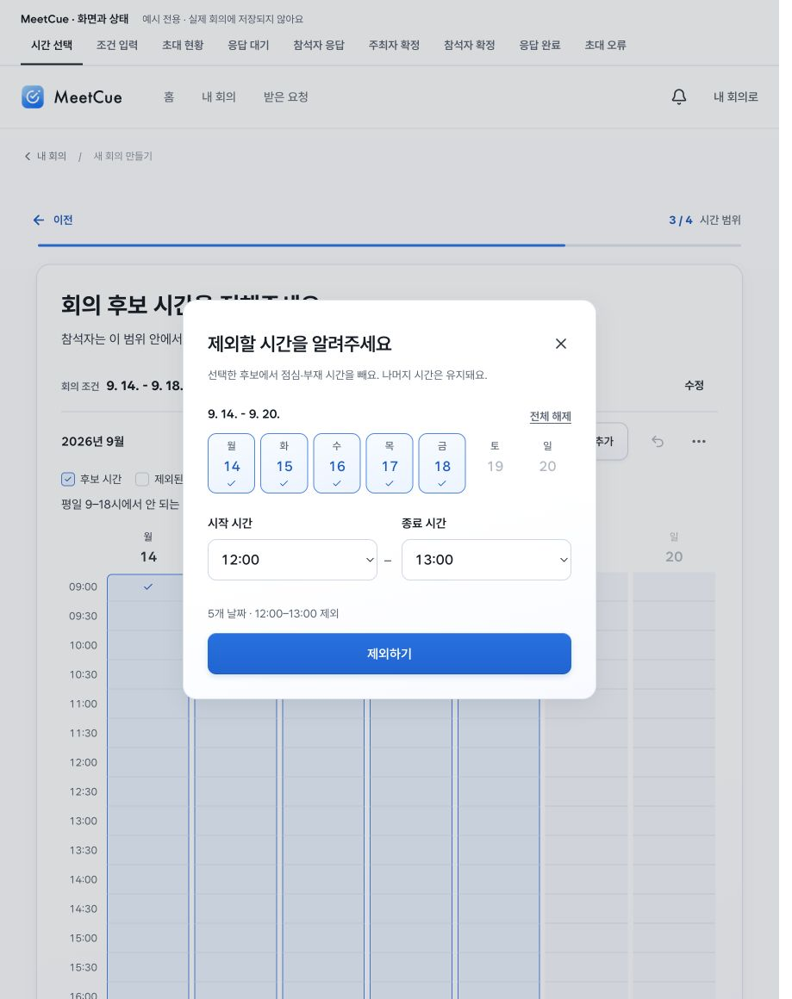

# 시간 선택: 정보와 입력 의도 정리

## 화면에서 확인한 문제

1. 기본 화면: 회의 범위(9/14–18)와 주간 범위(9/14–20)가 연달아 표시돼 두 날짜의 역할을 구분해야 했다. 총 10시간 30분은 회의 길이와 혼동할 가능성이 있다. 요일·시간 표기는 11px로 작았다.
2. 입력 진입: 시간 직접 입력은 추가·제외 중 무엇을 하려는지 드러내지 않았다. 진입 후 모드를 다시 정하는 단계도 필요했다.
3. 제외 중심 작업: 기본 평일 9–18시에서 안 되는 시간만 빼도 된다는 설명이 없어, 넓게 선택된 칸의 의도가 불명확했다.

## 적용

- 목적 → 회의 조건 → 입력 도구 → 범례와 조작 안내 → 달력 순서. 한 주 범위는 연월로 간결하게 표시하고 누적 시간·날짜 통계를 제거했다.
- 시간 제외 / 시간 추가는 각각 목적이 정해진 입력창을 연다. 날짜·시작·종료·적용만 남겼다. 기존 후보를 유지한다는 결과도 명시했다.
- 기본 평일 선택에서는 안 되는 시간만 빼라는 안내를 제공한다. 다른 선택 상태에서는 클릭·드래그 추가/제외를 안내한다.
- 달력은 항상 남아 있는 후보 시간을 표시한다. 체크·테두리로 선택을 표현하고 제외에 별도 경고색을 부여하지 않는다.
- 제목 24–28px, 설명 15px, 조작 안내 14px, 범례 13px, 시간·요일 12px. 모바일 입력 버튼 높이 44px.

## 브라우저 검증

1. 기본 화면 — 919px, 390px, 320px에서 확인. 390/320px 가로 넘침 없음. 390px 입력 버튼은 각각 너비 144.5px·높이 44px. 후보 제목 실제 24px, 본문 15px.
2. 제외 입력 — 평일 12–13시 적용 후 선택된 30분 칸 90→80, 점심 칸 선택 0. 되돌리기로 90 복원. 날짜 전체 해제 시 오류와 적용 비활성 확인.
3. 추가 입력 — 모드 토글 없이 추가 제목과 9–18시 기본값 확인. 이미 포함된 구간 적용은 중복 없이 90 유지. 시간표 비우기 후 제외 비활성·추가 활성, 추가 적용으로 0→90 확인.

메모리 예시에서 검증했다. 새로고침 시 예시는 초기화된다. 기존 탭의 CSS 핫 갱신이 일부 반영되지 않아 새 로드로 최종 스타일을 확인했다. 실제 저장 회의·응답 제출·확정은 변경하지 않았다. 실제 사용자 이해도, 실기기 터치, 스크린리더 전체 검증을 수행한 것은 아니다. 제외만 입력하는 방식의 효과는 사용성 테스트로 추가 확인할 가설이다.
