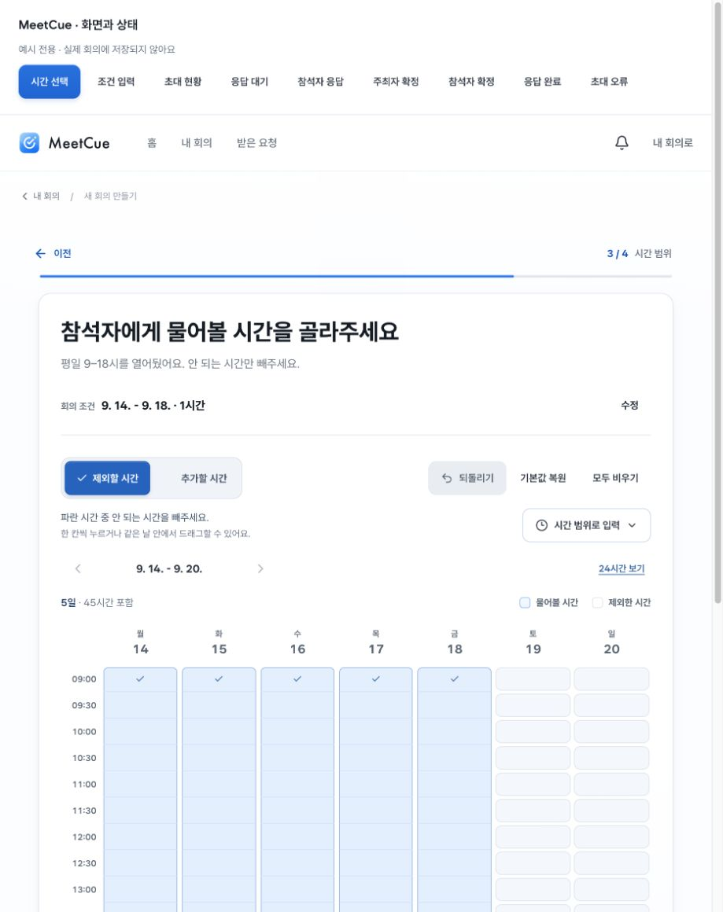
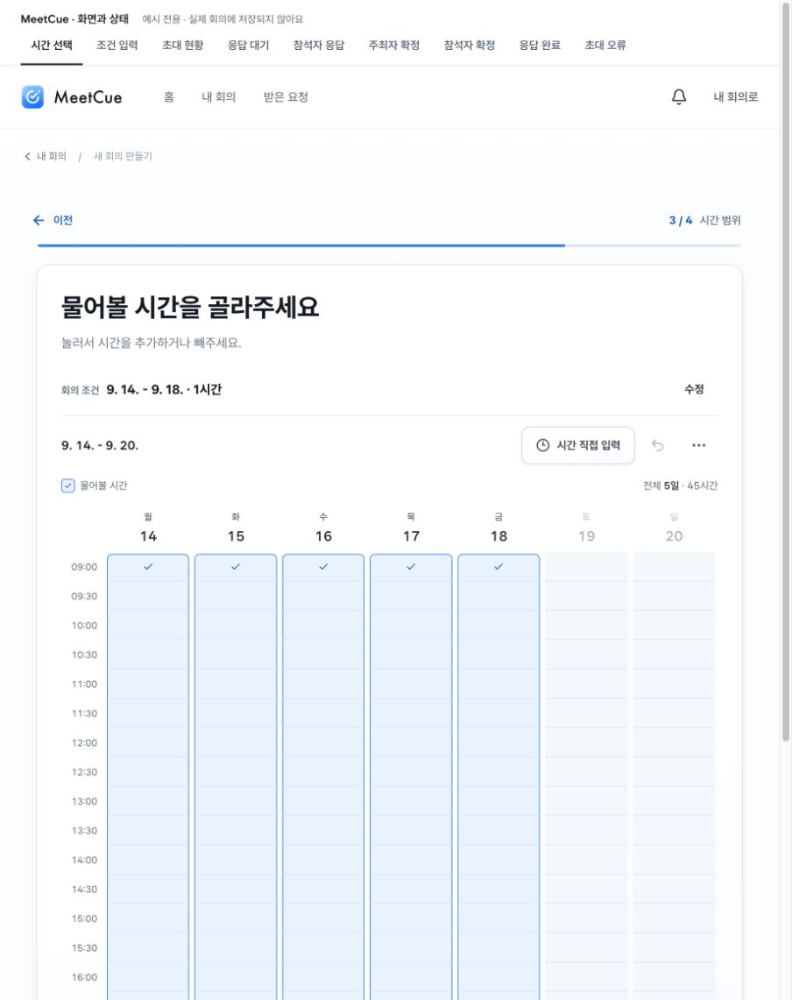
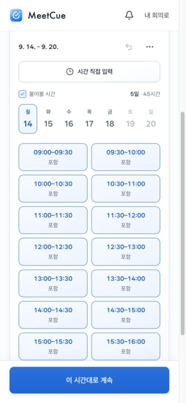
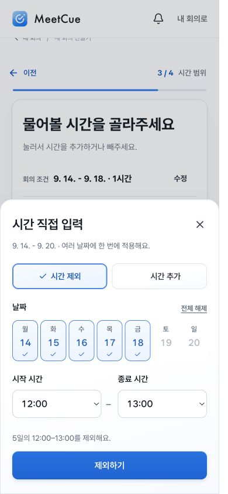

# 시간 선택 화면 재정리

## 진단

1. **기본 시간표 — 심각:** 모드·되돌리기·복원·비우기·직접 입력·보기 옵션·반복 설명·범례가 입력보다 먼저 등장했다. 선택을 쉽게 하려는 기능들이 오히려 먼저 해석해야 할 메뉴가 됐다.
2. **직접 입력 — 개선 필요:** 폼을 시간표 위에 펼치면서 두 입력 방식과 여러 적용 버튼이 한 화면에 놓였다. 날짜 선택 단축 버튼과 프리셋도 추가 행을 만들었다.
3. **색과 컴포넌트 — 개선 필요:** 모드, 안내, 필드, 보조 버튼마다 파란색을 별도로 지정했다. 검토 페이지 탭까지 진한 파랑이어서 핵심 행동의 위계를 흐렸다.

## 변경

- 시간표는 누르면 선택/해제, 드래그는 시작 칸 기준으로 동작한다. 전역 모드 선택을 없앴다.
- 직접 입력은 날짜·시작/종료·처리 방식을 정하는 별도 창이다. 적용하면 닫혀서 시간표와 동시에 편집하지 않는다.
- 보조 도구는 중립색, 선택은 공통 옅은 면과 테두리·체크, 주요 실행은 공통 Primary 버튼을 쓴다.
- 무드보드 011의 밝은 면·명확한 선택 외곽선을 참고했다. 큰 카드의 재질은 유지하며 반복되는 시간 칸의 개별 카드 테두리를 줄였다.
- 중복 설명과 프리셋, 색 안내판을 없앴다. 복원·비우기·24시간 보기는 옵션에 두고 되돌리기는 바로 접근할 수 있다.
- 새 CSS를 더 덧씌우는 대신 시간표 스타일 파일의 구형 규칙을 정리했다. 이번 입력 관련 CSS 4개는 공통 토큰만 참조한다.

## 비교

동일한 기본 예시(5일·45시간), 919px 폭. 상단 검토 도구도 함께 축소했다. 제품의 기본 시간표가 더 앞에 보이며 진한 색의 보조 컨트롤이 사라졌다.

### 변경 전

### 변경 후

### 모바일 시간표 / 직접 입력

## 현재 범위

이번 변경은 시간 선택과 그 입력 컴포넌트, 검토 도구에 집중했다. 사이트 전체의 구형 스타일·중복 토큰을 모두 정리한 것은 아니다. 다음 화면에서는 이 규칙을 그대로 적용하면서 그 화면의 기존 재질 선언을 제거해야 한다. 새 팔레트나 재질을 추가하지 않는다.

동작 검증은 [입력 검증 기록](../time-entry-2026-09-10.md)을 참고한다. 시각적 일관성 개선이 실제 사용자 테스트를 대신하지 않는다.
