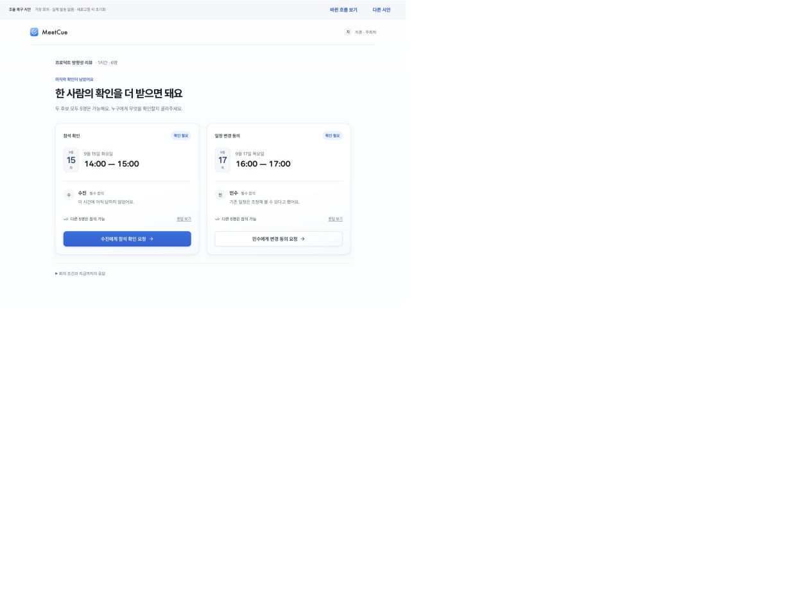
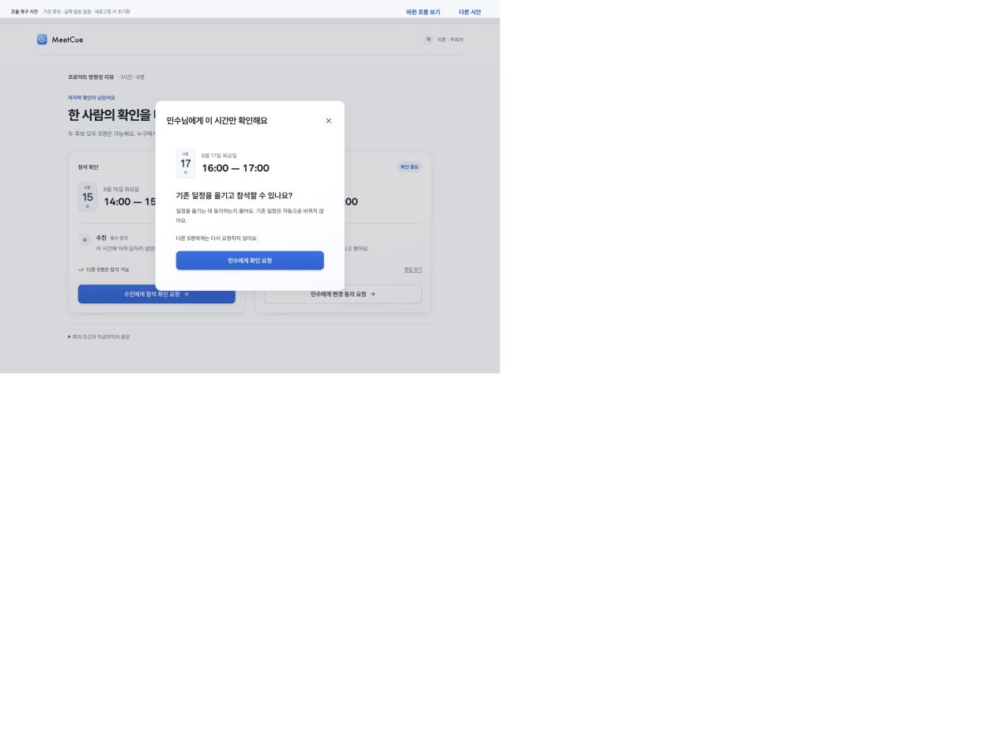
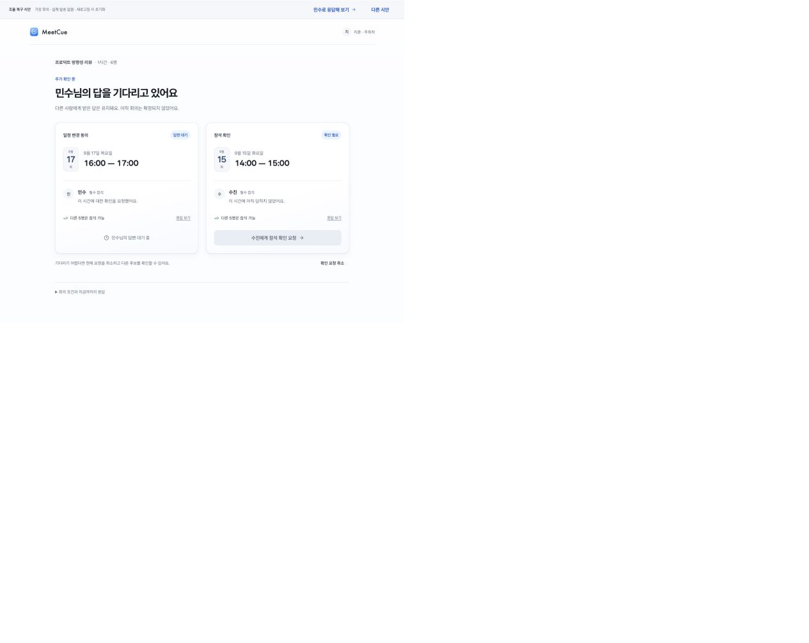
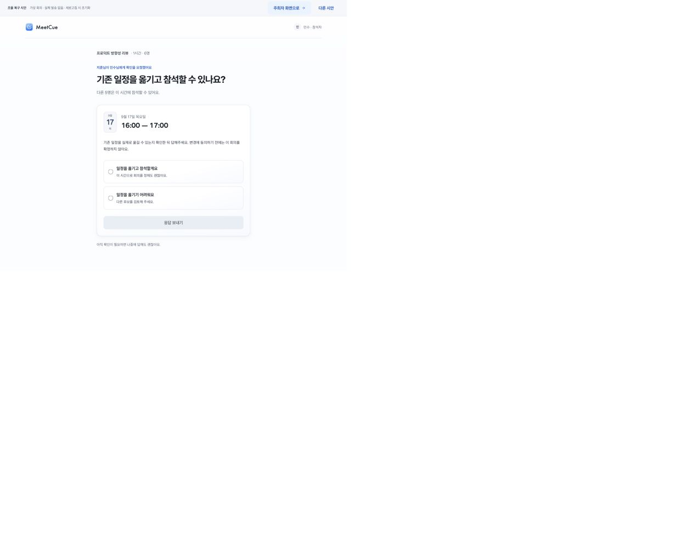

# 채용자 관점 재평가 · 2026-09-12

## 판정

기능과 다음 행동의 전달력은 좋아졌다. 그러나 독창적인 피벗이나 강한 문제 해결 역량의 증거로 평가를 바꿀 정도는 아니다. 현 단계에서 대표작으로 추천할 근거는 부족하다. 이는 에이전트의 평가이며 실제 심사 결과·지원자 비교·합격 가능성 추정이 아니다.

비교 기준은 이번 시안 직전까지 개선해 온 MeetCue다. 최초 제출물의 같은 상황·화면은 이번에 확보하지 않았으므로 최초 제출물과의 정확한 전후 비교라고 주장하지 않는다.

## 이번에 직접 확인한 흐름

현재 로컬 recovery 페이지의 주최자 → 변경 요청 → 대기 → 참석자 동의 입력을 새로 캡처했다. 응답 제출 이후의 확정·두 후보 거절은 이번 리뷰에서 재수행하지 않았으며 구현 코드와 해당 작업 기록의 한계 설명을 참고했다.

1. **주최자 후보 선택 — 전달력 양호, 판단 근거 부족.** 날짜·시간·남은 확인 대상과 행동을 읽기 쉽다. 두 후보가 모두 다른 5명의 참석 가능을 전제로 한다. 어떤 이유로 수진의 응답을 먼저 확인해야 하는지, 민수의 변경 부담이 어느 정도인지 판단할 근거는 부족하다. 파란 CTA는 화요일을 시각적으로 우선하지만 그 이유는 설명되지 않는다.

2. **질문 확인 — 목적 명확, 역할은 제한적.** 필요한 사람에게 한 시간만 묻는다. 기존 일정은 자동 변경하지 않음을 명시한다. 단, 기존 MeetCue에도 후보를 지정해 필요한 사람에게 요청하는 기능이 있어 이를 새 가치 전체로 설명하기 어렵다.

3. **응답 대기 — 병목 지속 위험.** 하나를 요청하면 다른 후보의 요청 버튼이 비활성화된다. 취소로 빠져나갈 수 있지만, 왜 한 번에 하나만 물어야 하는지 아직 근거가 없다. 요청을 읽지 않는 상황의 지연은 해결하지 않는다.

4. **참석자의 변경 동의 — 의미 구분 양호, 실제 조정 부담은 남음.** 동의와 거절을 명시적으로 고르게 한다. 버튼만으로 캘린더를 옮겼다고 표시하지 않는 점은 좋다. 기존 회의의 다른 참석자와 협의하는 작업은 여전히 밖에 있다. 다른 5명이 가능하다는 문구가 동의 압박으로 읽히는지는 관찰이 필요하다.

캡처는 모두 2026-09-12, 같은 가상 회의, `/meetcue/design-review.html?view=recovery`, 1280×900 브라우저 설정. 저장된 fullPage 이미지에는 캡처 도구의 배율/외곽 흰 여백 현상이 있다. 화면 내용과 DOM의 일치를 확인했으며 픽셀 크기 비교의 근거로 사용하지 않는다. 첫 자동 크기 캡처는 고정 크기로 재촬영했다.

접근성: 날짜·시간·상태에 텍스트가 있고 동의에는 라디오 의미가 있다. 변경 요청 창 진입 시 제목 포커스가 관찰됐다. 회색 보조 문구의 대비, 화면 상태 변경의 스크린리더 안내, 줌·키보드 전체 흐름은 이번 리뷰에서 평가하지 않았다.

## 채용 설득력을 제한하는 문제

- **문제와 시연 조건의 간격:** ‘합의가 없는 회의를 복구한다’고 제안했지만 시연은 한 명의 확인만 남은 두 후보로 시작한다. 공통 가능 시간이 없는 상황과 미응답이 남은 상황은 다르다. 두 후보 모두 거절되면 새 범위 입력 시안으로 넘어가며 재요청은 끊긴다. 가장 강한 주장을 가장 어려운 장면에서 뒷받침하지 못한다.
- **기존 기능과의 차이가 작음:** `HostCandidateDetail.tsx`는 선택한 후보 추가 요청과 바로 가능한 대안을 이미 제공한다. `HostResponseRequestDialog.tsx`는 필요한 수신자 선택을 제공한다. 기존 기능을 단순한 두 후보 흐름으로 드러낸 점이 핵심 변화다. 9/7 후보 우선 응답 기록에도 명시적인 조정 동의가 있다. 최초 제출 당시 존재 여부와는 별개다.
- **메신저 대비 이익이 아직 불명확:** 한 사람에게 한 시간을 물어 답을 받는 것은 단순한 메시지로도 수행 가능한 과업이다. 실제 전환 이유는 요청 자체보다 받은 답의 보존·후보 갱신·반복 확인 방지에 있어야 한다. 현재는 외부 전달·대기·수정까지 포함한 이익을 보여주지 않는다.
- **행동 안내와 결정 지원의 차이:** 누구에게 물을지는 표시하지만 언제 기다리고 언제 타인의 일정 변경을 요청할지 판단하는 근거는 약하다. 지연·변경 부담의 절충을 고려했다고 말하기에는 고정 순서와 두 카드만으로 부족하다.
- **시각적 안정성과 개성의 차이:** 공통 재질·타입·여백은 일관되고 읽기 쉽다. 하지만 시각적 완성도만으로 강하게 기억될 정도의 고유한 표현이나 상호작용이 드러나지는 않는다. 장식 추가를 권하는 뜻은 아니다.

## 다음 판단

새 화면을 더 늘리기 전에, ‘마지막 확인이 남은 회의’로 약속을 좁힐지, ‘모두 답했지만 합의가 없는 회의’까지 실제 해결할지를 선택해야 한다. 현재 기능과 맞는 것은 전자다. 후자를 주장하려면 서로 충돌하는 필수 참석자·실제 변경 동의·다른 후보로의 이동까지 일관된 한 사례가 필요하다.

포트폴리오에서는 ‘피벗으로 경쟁력을 확보했다’고 쓰지 않는다. ‘이전 기능을 다음 확인 행동 중심으로 재구성했고, 첫 시안은 유리한 예시에 의존한다는 한계를 발견했다’는 탐색 기록으로 보존한다. 테스트 개수는 구현 확인이며 제품 효과나 지원자 판단력의 대리 지표가 아니다.
