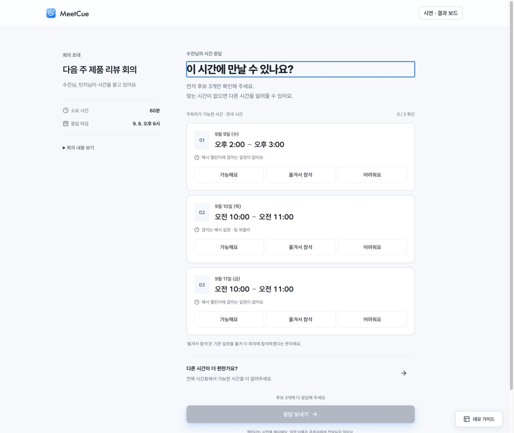
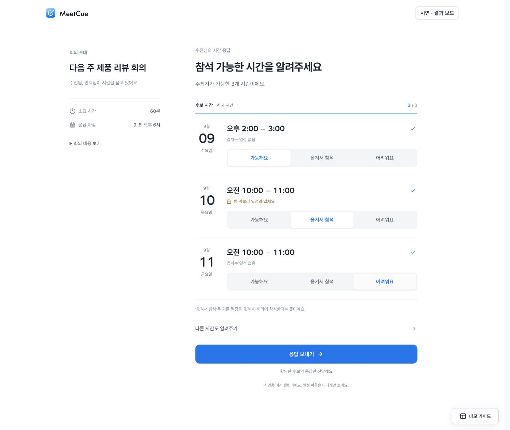
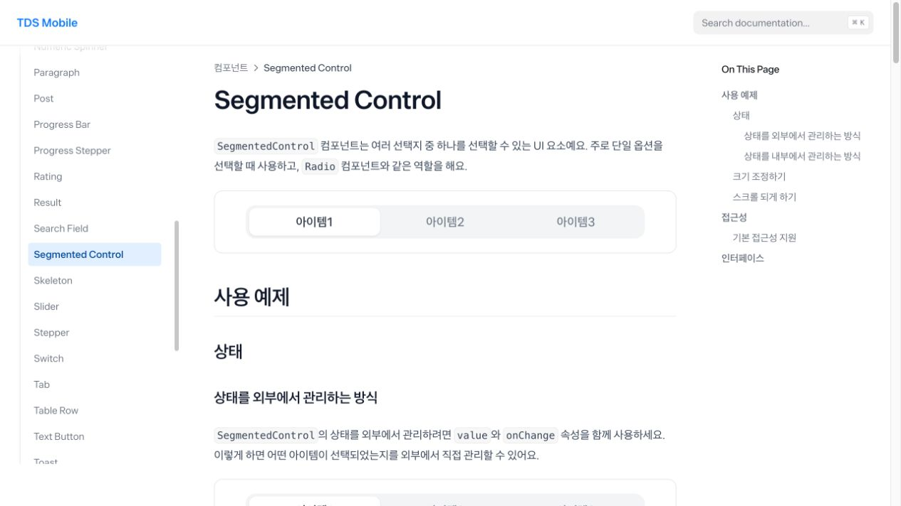
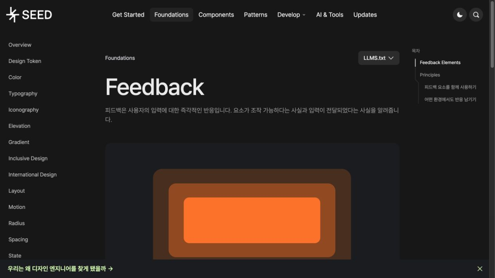

# 한국 제품 레퍼런스 기반 디자인 보강

2026-09-07 · 참석자 응답 / 범위 확장 / 응답 완료 화면

## 참고한 자료와 적용 범위

| 공식 레퍼런스 | 확인한 내용 | MeetCue 적용 |
| --- | --- | --- |
| [토스 TDS ListRow](https://tossmini-docs.toss.im/tds-mobile/components/ListRow/list-row-overview/) | 행의 영역 구성, 구분선과 패딩 | 반복 카드 대신 날짜와 시간의 정렬, 구분선으로 묶인 응답 목록 |
| [토스 TDS Segmented Control](https://tossmini-docs.toss.im/tds-mobile/components/segmented-control/) | 회색 트랙, 흰색 선택 면, 라디오 의미 | 흰 선택 표시가 이동하는 단일 선택 컨트롤. 초기값은 강제로 정하지 않음 |
| [당근 SEED Feedback](https://seed-design.io/foundations/feedback) | 입력 직후 색과 눌림 반응. 모션이 없어도 반응은 남아야 함 | 눌림 피드백, 선택 텍스트와 체크. 동작 줄이기에서는 모션을 제거하고 선택 상태를 유지 |
| [당근 SEED Motion](https://seed-design.io/foundations/motion) | 짧은 마이크로 모션과 화면 전환 모션의 구분 | 선택 180ms, 진행 표시 200ms, 화면 전환 240ms, 확인창 220ms |
| [토스: 인터랙션, 꼭 넣어야 해요?](https://toss.tech/article/interaction) | 제품 사용에서 인터랙션을 설명하고 적용하는 관점 | 시각 효과보다 입력과 상태 변화의 이해를 우선 |

브랜드 전체나 앱 화면을 복제한 것은 아니다. 원래의 회의 성립 모델과 MeetCue 색을 유지하며, 공식 자료의 구성 원칙을 이 작업에 맞게 적용했다. 실제 토스·당근 앱 전체 흐름을 감사한 것으로 해석하지 않는다.

## 화면 검토와 수정

1. **응답 시작 — 개선 완료.** 이전 화면은 같은 크기의 외곽선 카드, 후보 번호 상자, 반복 설명으로 시간이 작게 보였다. 카드와 번호 상자를 없애고 실제 날짜 숫자, 시간, 선택 컨트롤을 계층화했다. 흰 배경에서 얇은 구분선으로 묶고, 레거시 버튼 그림자를 이 흐름에서 제거했다.
2. **응답 선택 — 개선 완료.** 선택 면을 180ms에 걸쳐 이동시키고, 선택 완료 체크와 실제 응답 개수에 연결된 진행 선을 표시한다. 강제 다음 항목 이동이나 자동 응답은 없다. 최소 44px 높이의 네이티브 라디오를 유지한다.
3. **일정 조정 확인 — 개선 완료.** 페이지를 밀어내던 안내 상자를 모달로 바꾸고 실제 조정 대상 날짜·시간을 보여준다. 데스크톱은 중앙 확인창, 모바일은 바텀시트다. 네이티브 dialog의 modal 상태, Escape 닫기, 원래 버튼으로의 포커스 복귀를 확인했다.
4. **전체 시간표 — 연결 확인.** 화면 전환과 날짜별 시간표에 짧은 진입 모션을 추가했다. 슬롯을 칠할 때는 그리드 위치를 움직이지 않고 색만 바꾼다. 후보 ↔ 시간표 왕복 시 응답이 유지된다.
5. **응답 완료 — 개선 완료.** 과한 완료 카드와 반복 문구 대신 체크 표시, 실제 응답별 후보 수, 수정 행동을 보여준다. 체크 그리기는 성공 화면이 실제 렌더링될 때만 실행한다. 로컬 저장을 서버 전송 대기처럼 꾸미는 인위적인 로딩은 없다.

## 검증

- 실제 로컬 브라우저: 세 후보 응답, 조정 확인, Escape 및 닫기 후 포커스 복귀, 제출, 완료 집계 1/1/1, 편집 복원, 전체 시간표 왕복, 날짜 전환 확인.
- 선택 표시의 실제 computed transition: 180ms. 모바일 dialog의 실제 animation-name: response-sheet-in. native :modal 상태 확인.
- 320px에서 페이지 가용 폭과 scrollWidth 모두 305px, 라디오 터치 영역 높이 모두 44px. 390px 및 데스크톱에서 화면 확인.
- 방향키로 라디오 선택 변경 확인. prefers-reduced-motion 스타일 분기를 구현했으며, OS 설정 변경을 통한 수동 검증은 하지 않았다.
- build, lint, 도메인 테스트 39개 통과. 사용자 연구나 접근성 인증을 의미하지 않는다.

## 화면 자료

같은 제품 영역의 전후 화면이다. 이전은 미선택 상태, 이후 데스크톱은 세 응답을 고른 상태다. 참고 화면은 컴포넌트 원칙을 비교하기 위한 자료이며 전체 문서 사이트를 시각적으로 복제한 것이 아니다.

| 이전 응답 화면 | 개선한 응답 화면 |
| --- | --- |
|  |  |

| 토스 선택 컨트롤 참고 | 당근 피드백 참고 |
| --- | --- |
|  |  |

| 모바일 응답 | 조정 확인 | 응답 완료 |
| --- | --- | --- |
|  |  |  |
