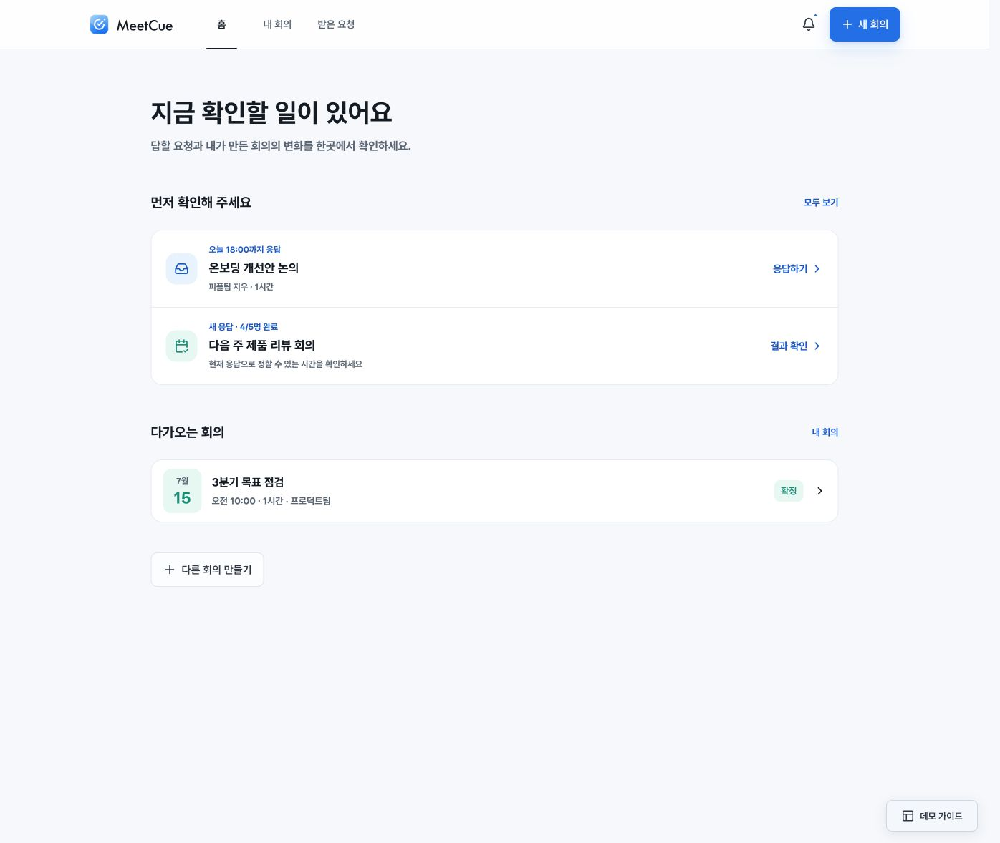
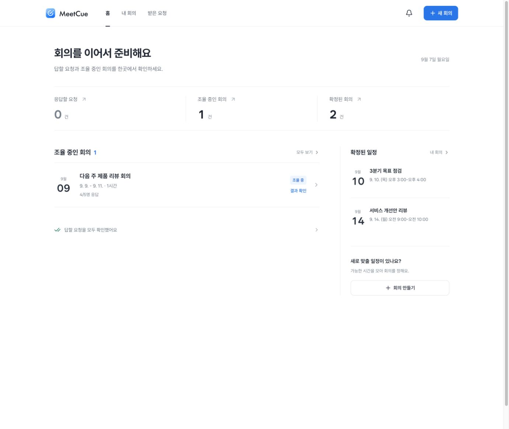
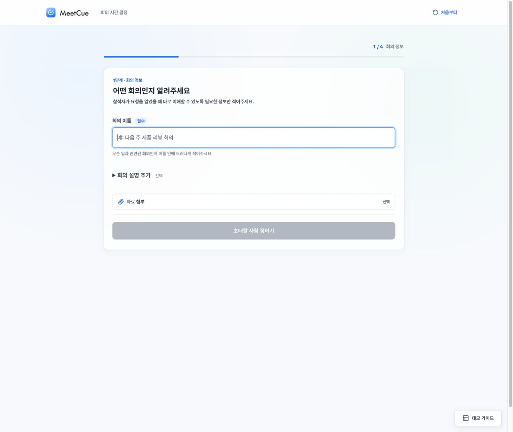
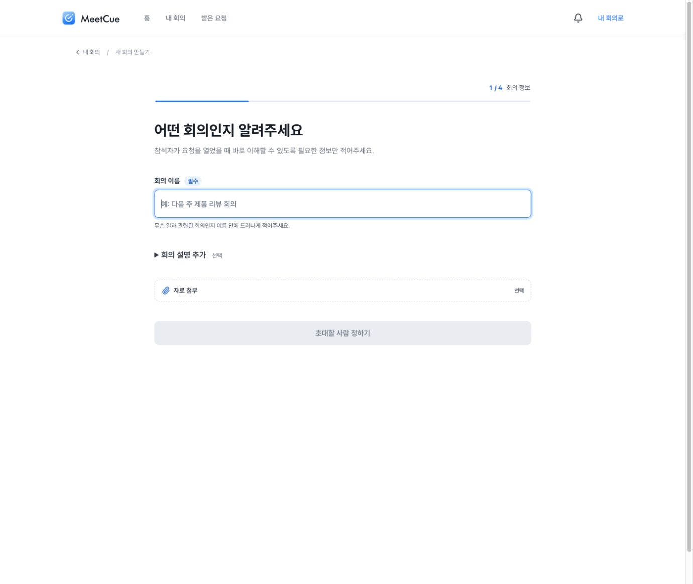
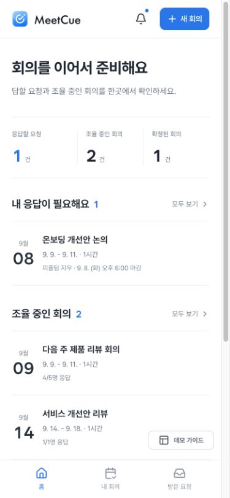
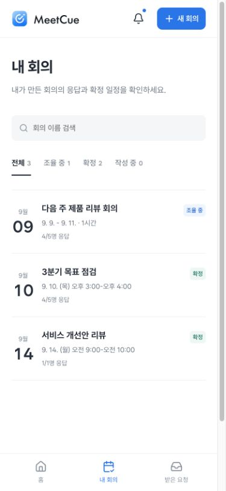
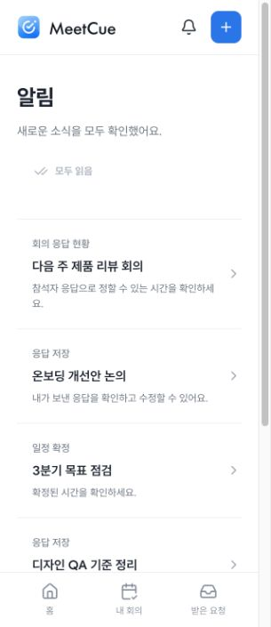
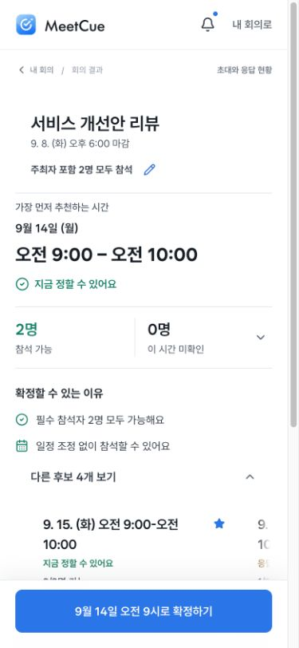
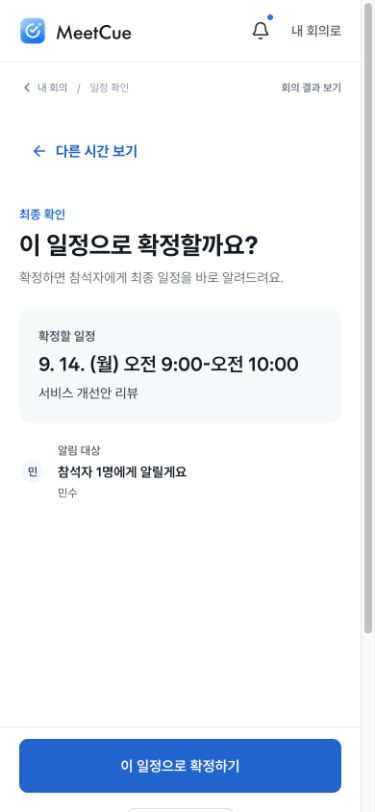
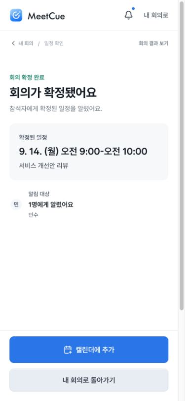

# 서비스 전체 흐름과 정보 위계 개선

2026-09-07. 로고가 홈으로 이동하지 않는다는 사용자 지적에서 출발해 기존 서비스의 실제 화면을 캡처하고, 홈·회의 생성·초대·응답·결과·확정·목록을 연결했다. 새 서비스나 별도 디자인 시안을 만드는 대신 기존 React 제품을 수정했다.

## 발견한 문제와 수정

1. **진입과 내비게이션 — 수정·확인.** 참석자 헤더는 로고가 단순 요소였고, 주최자 로고는 회의를 초기화했다. 공통 `BrandLink`를 실제 홈 링크로 바꾸고 홈을 기본 진입점으로 정했다. 홈·내 회의·받은 요청·알림은 빌드 환경과 무관하게 열리며, 주최자 화면에 현재 위치와 목록 복귀 경로를 둔다. 없는 회의 ID는 다른 회의 대신 복구 안내를 보여준다.
2. **홈과 목록 — 수정·확인.** 7월 날짜·응답 수·필터 수가 하드코딩되어 상세와 달랐다. 모든 목록을 회의 데이터에서 도출한다. 홈은 요약 → 응답할 요청 → 조율 중인 회의 순으로, 확정 일정은 보조 영역에 배치한다. 답할 요청이 없으면 조율 중인 회의를 먼저 보여주고 완료 안내는 작은 링크로 줄인다. 제목·날짜를 우선하고 반복 카드·배경 그라데이션·강한 그림자와 설명의 굵기를 줄였다. 검색과 상태 필터, 결과 없는 상태를 구현했다.
3. **생성과 저장 — 수정·확인.** 회의를 바꾸면 이전 회의가 덮어써지던 구조를 회의별 저장으로 바꿨다. 작성 중인 제목을 홈에서 다시 열고 새로고침 후 복원했다. 최종 검토에서 입력하지 않은 선택 설명은 숨긴다. 브라우저 저장 공간을 사용할 수 없으면 알린다.
4. **초대와 응답 — 수정·확인.** 초대 화면에서 참석자별 링크를 복사하거나 응답 화면을 열 수 있다. 실제 새 회의를 만들고 해당 참석자로 후보 3개에 응답했다. 후보에만 답한 범위는 유지하며, 홈에 돌아오면 응답 수가 반영된다. 받은 요청의 온보딩 회의에 응답한 뒤 ‘응답 필요 0 / 응답 완료·확정 2’로 이동하는 것을 확인했다.
5. **결과와 확정 — 수정·확인.** 선택 시간·판단 근거·주 행동을 중심으로 표면을 정돈하고 초대 현황으로 이동할 수 있게 했다. 새 회의 응답이 1/1명이 된 결과에서 9월 14일 오전 9시를 확정했다. 내 회의에 같은 확정 시간이 표시된다. 확정 뒤 캘린더 파일 받기와 목록 복귀 동작을 제공한다. 외부 알림을 실제 발송했다는 확정 문구는 제거했다.
6. **알림과 작은 화면 — 수정·확인.** 알림을 모두 읽은 뒤 새로고침해도 읽음 상태와 헤더 표시가 유지됐다. 390px와 320px에서 확인했으며, 320px의 기존 body 최소 너비로 생기던 넘침을 수정했다. 계정 메뉴는 모바일 하단에 두고 시연 가이드는 문서 하단으로 이동해 작업을 가리지 않게 했다.

## 이번 점검에서 캡처한 화면

전후 비교는 같은 제품의 다른 시점이다. 변경 후에는 테스트로 생성한 ‘서비스 개선안 리뷰’와 실제로 제출한 예시 응답이 포함된다. 07·08·11·12 화면은 흐름 검증 당시 캡처이며, 이후 빈 설명 행·초대 행 테두리·외부 발송을 암시하던 문구를 추가 수정했다. 05·06은 최종 홈 우선순위와 생성 화면 여백 수정 후 다시 캡처했다.

| 이전 홈 | 검증 후 최종 홈 |
| --- | --- |
|  |  |

| 이전 생성 화면 | 최종 생성 화면 |
| --- | --- |
|  |  |

| 모바일 홈 | 모바일 회의 목록 | 320px 알림 |
| --- | --- | --- |
|  |  |  |

| 결과 | 확정 전 확인 | 확정 완료 |
| --- | --- | --- |
|  |  |  |

[요청 검토](07-create-review.png) · [초대 관리](08-invite-management.png) · [이전 참석자 화면](01-before-invite.png) · [이전 결과 화면](03-before-results.png)

## 구현과 검증

- 공통 브랜드 링크, 일반 해시 링크, 회의 ID를 포함하는 상세 URL, 페이지 제목·본문 바로가기·화면 진입 포커스.
- `workspace.ts`: 회의별 기록, 브라우저 저장 복원/손상 데이터 복구, 요청 상태와 알림 키. 기존 회의와 새 회의의 ID가 충돌하지 않는다.
- 목록 수·확정 날짜·마감·응답 수는 해당 회의의 실제 상태에서 계산. 상태별 필터와 제목 검색은 함께 적용한다.
- `calendarExport.ts`: 실제 선택 시간의 ICS 파일 생성. 텍스트 이스케이프, UTC 시간, 75바이트 줄 접기를 테스트했다. 외부 캘린더 앱으로 가져오는 과정은 검증하지 않았다.
- 기존 후보 응답 도메인 회귀 검증 포함 **44개 테스트 통과**, 빌드·린트·diff 공백 검사 통과.
- 브라우저에서 생성 4단계 → 초대 링크 → 3개 후보 응답 → 결과 → 확정 → 내 회의까지 직접 수행. 별도로 홈 로고, 임시 저장·새로고침, 받은 요청 완료 이동, 검색 빈 결과와 복구, 알림 읽음·새로고침, 없는 회의 링크를 확인했다.
- 390px 홈·결과·확정·목록과 320px 응답·요청 목록·알림을 확인. 최종 320px 확인에서 document clientWidth/scrollWidth 모두 305px(스크롤바 제외). 전체 스크린리더 사용성이나 OS 동작 줄이기 설정까지 검증한 것은 아니다. 새 모션은 해당 CSS 설정을 존중한다.

## 제품 범위

브라우저에 저장하는 작동 가능한 프로토타입이다. 계정 인증, 서버 동기화, 실제 메일/메신저 발송, 다른 기기에서의 초대 링크 공유는 구현하지 않았다. 초대 관리 화면에서 같은 브라우저의 예시 환경임을 표시한다. 이번 수정은 서비스의 탐색·상태 일관성·정보 위계·완료 후 행동을 개선하는 범위이며 실제 사용자 평가나 채용 결과 개선을 검증한 것은 아니다.
